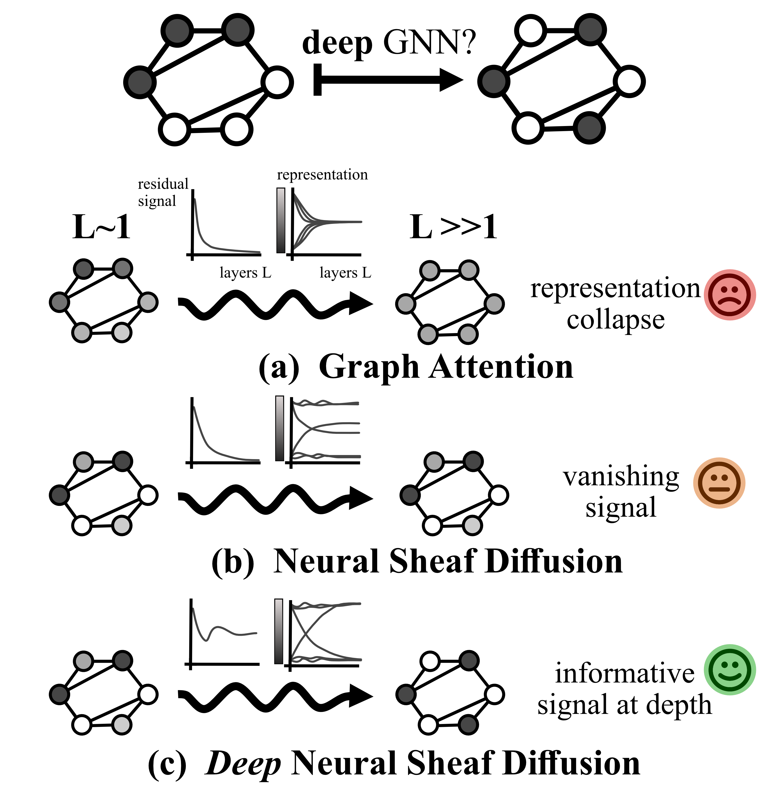
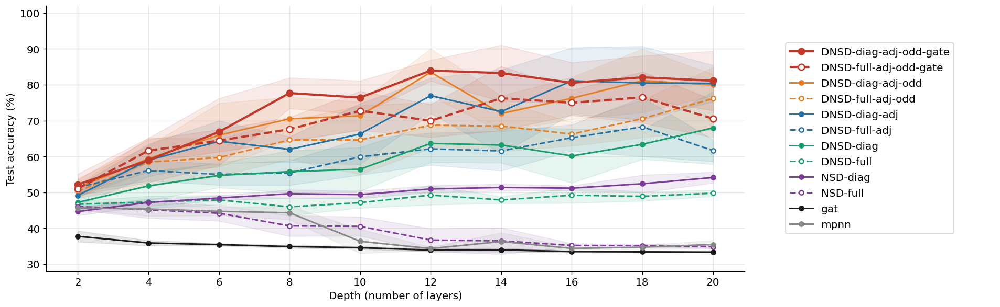

# Deep Neural Sheaf Diffusion

Code for the paper [**"Deep Neural Sheaf Diffusion"**](https://arxiv.org/abs/2605.19021) — accepted at the ICML 2026 Workshop on Graph Foundation Models (GFM@ICML 2026), Seoul, South Korea.

*Rémi Bourgerie, Šarūnas Girdzijauskas, Viktoria Fodor*

<p align="center"></p>

---

## What is this?

Standard GNNs struggle at depth: repeated aggregation causes representations to collapse (oversmoothing) or lose sensitivity (oversquashing). Neural Sheaf Diffusion (NSD, Bodnar et al. 2022) has strong theoretical guarantees against collapse, but in practice the update signal vanishes as depth increases — deeper layers receive progressively smaller inputs.

**DNSD fixes this** by replacing the sheaf Laplacian with a sheaf adjacency operator. Instead of measuring *disagreement* between neighbours (which shrinks to zero as diffusion progresses), it aggregates *dependency* — a signal that stays informative at any depth. Three complementary flags further stabilise deep training:

| Flag | What it does | Why it helps |
|------|-------------|--------------|
| `adj` | Adjacency operator instead of Laplacian | Prevents vanishing signal at depth |
| `odd` | Tanh activation instead of ReLU | Prevents one-sided drift under repeated composition |
| `gate` | Per-stalk sigmoid gate on diffusion updates | Reduces variance; filters noisy contributions |

The result: DNSD improves with depth up to 12–16 layers, while GAT and NSD plateau or degrade.

---

## Install

```bash
pip install -r requirements.txt
```

Tested with Python 3.11, PyTorch 2.7.1, PyG 2.6.1 on Linux (CUDA and CPU).

---

## Quick start

```python
import torch
from torch_geometric.data import Data
from models import create_model, train_model

# Your graph data (standard PyG format)
data = Data(x=node_features, edge_index=edge_index, y=labels)
data.train_mask = ...  # bool tensor, shape [N]
data.val_mask   = ...
data.test_mask  = ...

# Build a DNSD model — key parameters:
#   hidden_dim   total hidden size; must be divisible by num_stalks
#   num_stalks   stalk dimension d; stalk_dim = hidden_dim / num_stalks
#   adj/odd/gate DNSD flags (all False = plain NSD-style baseline)
model = create_model(
    'dnsd_diag',
    input_dim  = data.x.size(1),
    hidden_dim = 64,   # 64 / 8 = 8-dim stalks
    output_dim = data.y.max().item() + 1,
    num_stalks = 8,
    num_layers = 8,
    adj=True, odd=True, gate=True,  # full DNSD
)

# Train — returns (val_acc, test_acc, history)
val_acc, test_acc, history = train_model(model, data, lr=0.01, epochs=500)
print(f"Test accuracy: {test_acc:.4f}")
```

`train_model` uses Adam + ReduceLROnPlateau (patience 20) + early stopping (patience 100). The best checkpoint is automatically restored.

### Choosing parameters

- `hidden_dim` must be divisible by `num_stalks`. The paper uses `hidden_dim=18, num_stalks=3` for synthetic experiments and `hidden_dim=64, num_stalks=8` for real-world.
- Start with `adj=True, odd=True` — these provide the largest gains. Add `gate=True` to reduce variance across runs.
- Diagonal maps (`dnsd_diag`) match or outperform full maps (`dnsd_full`) while being faster.
- DNSD benefits from depth: try `num_layers` in `{8, 12, 16}`.

### Training on a separate test graph (synthetic setting)

For the synthetic benchmark, train and test graphs are generated independently. Pass `test_data` to evaluate on a separate graph:

```python
val_acc, test_acc, history = train_model(
    model, train_data, lr=0.01, epochs=500, test_data=test_data
)
```

---

## Reproduce the paper

### Figure 2 — depth scaling at G5

```bash
python train_synthetic.py --config config_figure2.yaml --output results_figure2.csv
python plot_figure2.py --results results_figure2.csv --level 5 --output figure2.png
```

Sweeps depths 2–20 for all model variants at perturbation level G5. Benchmark graphs are cached to `./data/community_cache/` on first run (~2 min for 9 graphs). Expected output:



### Table 2 — synthetic community detection (~12 h on a single GPU)

```bash
python train_synthetic.py --config config_synthetic.yaml --output results_synthetic.csv
```

Sweeps all perturbation levels G0–G10, all model variants, 5 model seeds. The key finding: DNSD variants with `adj=True` outperform NSD by 20–30pp at mid-heterophily levels (G3–G9).

| Model | Map | Adj | Odd | Gate | G0 | G1 | G2 | G3 | G4 | G5 | G6 | G7 | G8 | G9 | G10 |
|-------|-----|:---:|:---:|:----:|----|----|----|----|----|----|----|----|----|----|----|
| MLP | — | | | | 41.3±0.3 (L2) | 41.4±0.2 (L2) | 41.3±0.3 (L2) | 41.3±0.3 (L2) | 41.3±0.1 (L2) | 41.3±0.2 (L2) | 41.2±0.2 (L2) | 41.2±0.3 (L2) | 41.3±0.2 (L2) | 41.2±0.2 (L2) | 41.5±0.2 (L2) |
| MPNN | — | | | | 53.9±2.0 (L2) | 47.0±1.0 (L2) | 49.6±3.3 (L4) | 47.7±1.2 (L2) | 47.1±1.5 (L2) | 45.6±0.4 (L2) | 45.0±1.1 (L2) | 45.6±0.7 (L2) | 46.6±0.5 (L2) | 50.2±1.0 (L4) | 94.7±2.2 (L8) |
| GAT | — | | | | 🥇 67.2±15.9 (L8) | 45.6±2.1 (L4) | 47.9±2.0 (L4) | 43.9±1.2 (L4) | 38.6±2.2 (L4) | 37.7±1.5 (L2) | 36.7±1.8 (L2) | 36.1±1.0 (L2) | 41.8±1.1 (L2) | 46.7±1.1 (L4) | 64.8±2.0 (L4) |
| NSD | diag | | | | 53.0±16.4 (L12) | 51.0±6.4 (L16) | 55.8±0.9 (L12) | 54.7±2.3 (L16) | 51.2±2.1 (L16) | 51.2±0.7 (L16) | 49.1±1.7 (L16) | 49.1±1.2 (L12) | 50.1±1.0 (L16) | 50.5±1.5 (L16) | 85.5±4.7 (L16) |
| NSD | full | | | | 53.1±5.6 (L16) | 46.4±1.4 (L2) | 49.2±1.8 (L4) | 46.0±0.5 (L2) | 46.4±1.2 (L2) | 46.1±0.9 (L2) | 45.2±0.7 (L2) | 45.5±0.4 (L2) | 46.7±0.7 (L2) | 49.3±1.1 (L8) | 84.0±4.0 (L12) |
| DNSD | diag | ✓ | ✓ | ✓ | 45.7±10.1 (L16) | 51.0±9.1 (L4) | 🥈 73.9±5.7 (L12) | 🥇 83.5±4.3 (L12) | 🥇 82.4±7.3 (L12) | 🥇 83.9±2.9 (L12) | 🥇 86.1±1.8 (L12) | 🥈 81.5±5.5 (L16) | 🥈 75.6±4.7 (L16) | 🥈 63.4±4.4 (L12) | 96.2±1.3 (L16) |
| DNSD | diag | ✓ | ✓ | | 51.1±6.1 (L16) | 🥇 57.3±3.5 (L12) | 🥇 74.5±1.9 (L12) | 🥈 75.4±11.1 (L12) | 🥈 79.6±8.7 (L12) | 🥈 83.5±6.6 (L12) | 🥈 83.3±4.5 (L12) | 🥇 82.2±4.5 (L16) | 🥇 77.1±2.0 (L16) | 🥇 64.3±1.8 (L16) | 96.7±0.7 (L16) |
| DNSD | diag | ✓ | | ✓ | 48.0±9.5 (L4) | 49.9±7.6 (L16) | 58.2±1.8 (L16) | 62.0±10.1 (L8) | 🥉 72.5±6.2 (L12) | 🥉 80.4±9.4 (L12) | 🥉 81.0±8.0 (L12) | 🥉 77.3±5.2 (L12) | 🥉 74.4±6.3 (L12) | 🥉 61.0±3.3 (L12) | 95.7±1.4 (L16) |
| DNSD | diag | | ✓ | ✓ | 🥈 59.2±20.9 (L12) | 51.0±13.2 (L16) | 63.3±6.2 (L16) | 🥉 65.5±14.9 (L16) | 66.9±8.0 (L12) | 71.4±11.8 (L16) | 71.1±7.5 (L16) | 70.6±7.4 (L16) | 62.8±5.2 (L16) | 55.5±4.3 (L16) | 95.3±2.6 (L16) |
| DNSD | diag | | | | 50.4±6.4 (L16) | 49.8±5.0 (L16) | 54.9±4.1 (L4) | 53.5±5.3 (L16) | 60.8±9.8 (L16) | 63.6±5.3 (L12) | 60.4±7.7 (L16) | 58.8±6.2 (L16) | 57.8±4.5 (L16) | 53.4±1.7 (L16) | 96.4±0.8 (L16) |
| DNSD | full | ✓ | ✓ | ✓ | 52.5±4.4 (L12) | 52.5±4.8 (L12) | 65.4±3.3 (L12) | 63.3±4.9 (L16) | 69.0±3.7 (L16) | 75.0±3.5 (L16) | 72.4±5.1 (L16) | 69.0±2.6 (L16) | 64.6±4.4 (L16) | 56.1±1.9 (L12) | 🥉 97.1±0.7 (L16) |
| DNSD | full | ✓ | ✓ | | 52.1±2.0 (L12) | 🥈 54.0±3.9 (L16) | 🥉 64.3±4.4 (L16) | 61.2±3.2 (L12) | 63.0±3.4 (L16) | 68.7±6.4 (L12) | 63.5±5.8 (L16) | 59.5±2.3 (L12) | 55.3±2.8 (L12) | 53.2±1.3 (L16) | 🥈 97.3±1.3 (L16) |
| DNSD | full | ✓ | | ✓ | 51.7±2.3 (L16) | 🥉 53.3±4.8 (L8) | 61.7±4.9 (L8) | 61.7±5.4 (L12) | 68.0±11.0 (L16) | 73.0±4.7 (L16) | 66.2±7.7 (L16) | 63.9±5.3 (L16) | 63.3±5.0 (L16) | 55.2±1.6 (L16) | 🥇 97.5±0.8 (L16) |
| DNSD | full | | ✓ | ✓ | 🥉 54.3±5.6 (L16) | 51.4±4.4 (L16) | 58.9±1.7 (L16) | 56.6±2.7 (L16) | 57.2±4.3 (L16) | 58.0±2.6 (L12) | 54.3±5.5 (L12) | 53.7±3.2 (L16) | 53.1±2.7 (L16) | 52.7±1.0 (L12) | 95.5±1.6 (L16) |
| DNSD | full | | | | 47.5±0.8 (L12) | 47.9±4.1 (L2) | 52.4±1.6 (L16) | 49.0±2.4 (L16) | 50.3±3.2 (L16) | 49.2±2.7 (L12) | 46.6±2.5 (L16) | 46.4±1.8 (L16) | 47.6±1.1 (L16) | 50.4±0.9 (L16) | 96.7±1.9 (L16) |

### Table 3 — real-world heterophilic benchmarks (~6 h on a single GPU)

```bash
python train_realworld.py --config config_realworld.yaml --output results_realworld.csv
```

Datasets are downloaded automatically via `torch_geometric` on first run. DNSD (diag, adj+odd) achieves best or second-best on 5 out of 6 datasets, with the largest gains on Roman Empire (+4.1pp) and Penn94 (+3.7pp over NSD diag).

| Model | Map | Adj | Odd | Gate | Roman Empire | Amazon Ratings | Minesweeper | Tolokers | Questions | Penn94 |
|-------|-----|:---:|:---:|:----:|-------------|----------------|-------------|----------|-----------|--------|
| MLP | — | | | | 66.4±0.1 (L2) | 40.9±0.4 (L2) | 80.0±0.0 (L2) | 78.2±0.0 (L2) | 97.0±0.0 (L2) | 76.2±0.0 (L2) |
| MPNN | — | | | | 78.9±0.8 (L2) | 46.6±0.3 (L4) | 87.4±1.3 (L4) | 79.1±0.1 (L2) | 97.0±0.0 (L2) | — |
| GAT | — | | | | 56.9±1.1 (L2) | 46.0±0.6 (L2) | 80.3±0.0 (L2) | 78.4±0.1 (L4) | 97.0±0.0 (L2) | 74.1±2.0 (L2) |
| NSD | diag | | | | 79.1±0.5 (L8) | 44.6±0.3 (L8) | 87.5±0.6 (L8) | 81.5±0.2 (L8) | 97.1±0.0 (L2) | 76.3±0.1 (L2) |
| NSD | full | | | | 77.1±0.9 (L4) | 45.4±0.7 (L4) | 86.1±0.3 (L4) | 81.4±0.3 (L2) | 97.1±0.0 (L2) | 76.1±0.6 (L4) |
| DNSD | diag | ✓ | ✓ | ✓ | 🥈 83.4±0.9 (L8) | 🥈 47.8±0.4 (L8) | 🥇 89.4±0.8 (L8) | 🥈 81.8±0.5 (L4) | 97.1±0.0 (L4) | 🥈 78.7±0.9 (L8) |
| DNSD | diag | ✓ | ✓ | | 🥉 83.2±0.7 (L8) | 🥇 49.1±0.7 (L8) | 🥈 88.9±0.4 (L8) | 🥇 82.0±0.2 (L8) | 97.1±0.0 (L2) | 🥇 80.0±0.9 (L8) |
| DNSD | diag | ✓ | | ✓ | 83.0±0.4 (L8) | 🥉 47.5±1.0 (L4) | 88.1±0.8 (L8) | 🥉 81.8±0.7 (L8) | 97.1±0.0 (L4) | 🥉 78.6±0.9 (L8) |
| DNSD | diag | | ✓ | ✓ | 🥇 83.4±0.2 (L8) | 46.0±0.4 (L2) | 🥉 88.2±0.5 (L8) | 81.5±0.4 (L8) | 🥇 97.2±0.0 (L2) | 76.0±0.6 (L4) |
| DNSD | diag | | | | 82.7±0.5 (L8) | 46.8±0.5 (L8) | 87.6±0.6 (L8) | 81.1±0.4 (L2) | 🥈 97.2±0.0 (L8) | 76.5±0.4 (L8) |

---

## Model reference

All models are instantiated via `create_model(name, **kwargs)` and trained via `train_model(model, data, **kwargs)`.

### Available models

| Name | Description |
|------|-------------|
| `dnsd_diag` | DNSD with diagonal restriction maps (recommended) |
| `dnsd_full` | DNSD with full d×d restriction maps |
| `nsd_diag` | NSD v1 (Bodnar et al. 2022), diagonal maps |
| `nsd_full` | NSD v1, full maps |
| `gat` | Graph Attention Network |
| `mpnn` | Message Passing Neural Network |
| `mlp` | MLP (ignores graph structure) |

### Key `create_model` arguments

| Argument | Type | Description |
|----------|------|-------------|
| `input_dim` | int | Input feature dimension |
| `hidden_dim` | int | Total hidden size — must be divisible by `num_stalks` |
| `output_dim` | int | Number of classes |
| `num_stalks` | int | Stalk dimension d; `stalk_dim = hidden_dim / num_stalks` |
| `num_layers` | int | Number of message-passing layers |
| `adj` | bool | Use adjacency operator (DNSD only, default False) |
| `odd` | bool | Use tanh activation (DNSD only, default False) |
| `gate` | bool | Use per-stalk gate (DNSD only, default False) |

### `train_model` signature

```python
val_acc, test_acc, history = train_model(
    model,
    data,               # PyG Data with train_mask / val_mask / test_mask
    lr=0.01,
    weight_decay=5e-4,
    epochs=500,
    seed=42,
    verbose=False,
    test_data=None,     # optional separate test graph (synthetic setting)
)
```

---

## Citation

```bibtex
@inproceedings{bourgerie2026dnsd,
  title     = {Deep Neural Sheaf Diffusion},
  author    = {Bourgerie, R{\'e}mi and Girdzijauskas, {\v{S}}ar{\=u}nas and Fodor, Viktoria},
  booktitle = {ICML 2026 Workshop on Graph Foundation Models (GFM@ICML 2026)},
  url       = {https://arxiv.org/abs/2605.19021},
}
```
